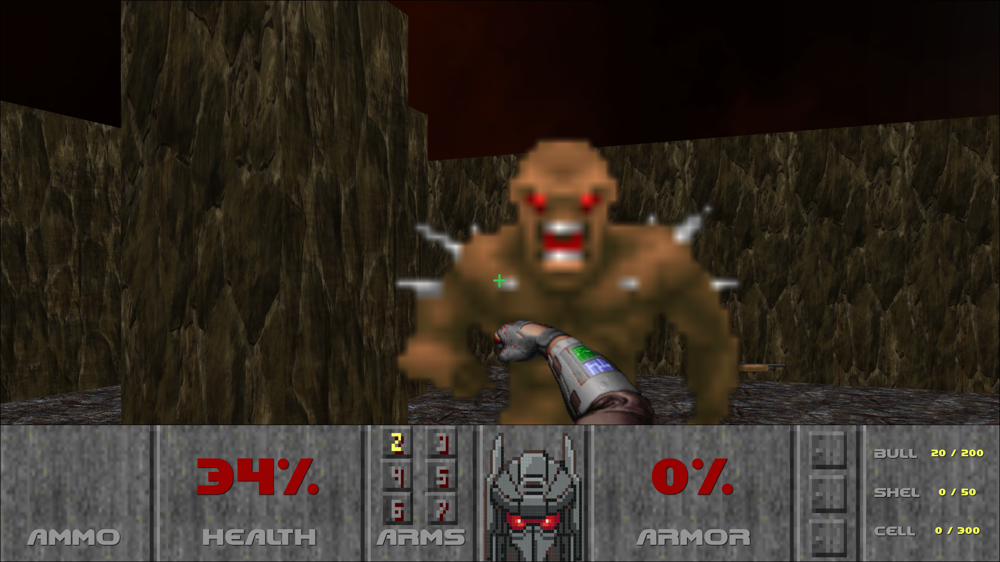

# FarSpace832c


FarSpace832c is a first person shooter game that will make you learn a whole lot of things about the colonization of exoplanets. Based on scientific reports, this game invites you to explore the current possibilities of the space conquest. Your robot has arrived on Gliese 832 C, an explonet considered to be 81% "like Earth". Your mission: gather the resources that are required in order to develop a human colony, in view of the arrival of human settlers. In order not to get bored, your robot is going to simulate live action phases as he is collecting resources crates. It is up to you to come to the end and build your base ! 

    
[](https://opensource.org/licenses/)

  
## Authors

- [Jean Barbet](https://www.github.com/jbeaarn)
- [Louis Ducrocq](https://www.github.com/Louis-duc)
- [Louis Manouvrier](https://www.github.com/Spac3Drunk)
- [Hugo Martel](https://www.github.com/HugoMartel)
- [Théodore Martin](https://www.github.com/TT-txt)
- [Pierre Mazure](https://www.github.com/pierremaz)

  
## Tech Used

**Client:** [Angular](https://angular.io/), [Babylonjs](https://www.babylonjs.com/), [98.css](https://jdan.github.io/98.css/)

**Server:** [Node](https://nodejs.org/en/), [Express](https://expressjs.com/), [MySQL](https://www.mysql.com/), [Socket.io](https://socket.io/)

  
## Installation 

### Run the client side

Install the project

```bash 
  git clone https://github.com/HugoMartel/FarSpace832c
  cd FarSpace832c
  npm install
  npm run build
```

If you want to connect to the database run the server, otherwise just run `dist/index.html`!

---

### Run the server side

```bash
  npm start
```
Then, simply connect to `https://localhost:4200` or your custom hostname!


  
## Documentation

[Documentation](./TODO)

  
## Demo

### First Person Shooter, a Doom Like:

---


This is one part of the game we created, were you'll be the small robot on this unknown planet, dreaming of fighting hordes of enemy while searching for the precious crate of resources.



This part of the game will bring you some classic 
[doom 1993](https://github.com/id-Software/DOOM) 
vibes, all written using javascript, [Babylonjs](https://www.babylonjs.com/)
. The enemies also have a small IA, telling them where to go and when to shoot following the action of the player (thanks [TT-txt](https://www.github.com/TT-txt)
). While performing this bloody massacre and searching, you will be earing one smooth of a track composed by [Pierre Mazure](https://github.com/pierremaz).

---

### Management Game, when learning is fun


In this part of the game you will learn some stuff about space exploration, and you'll create your own base on this new planet: 832C. Remember that the terrain is generated randomly at every game restart (thanks - [Louis Manouvrier](https://www.github.com/Spac3Drunk)).
